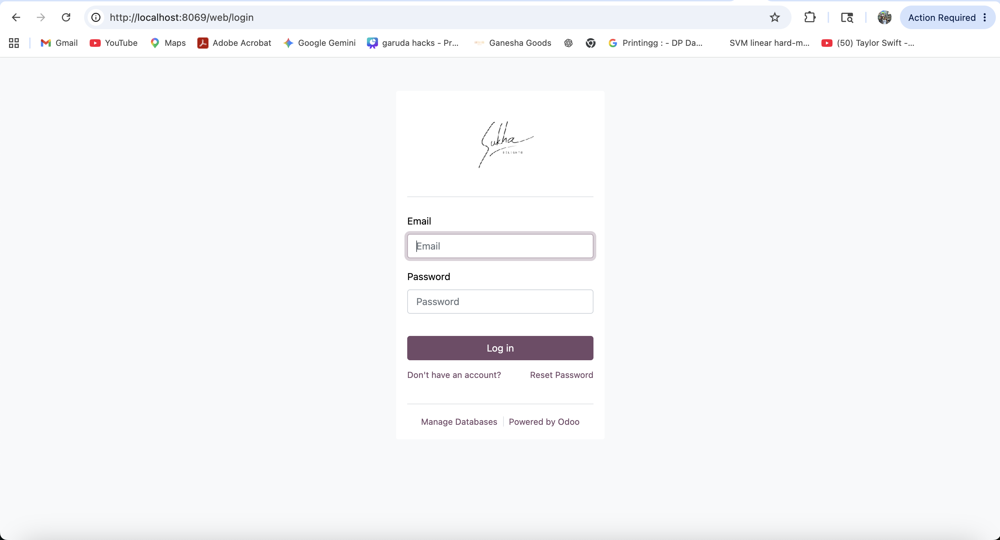
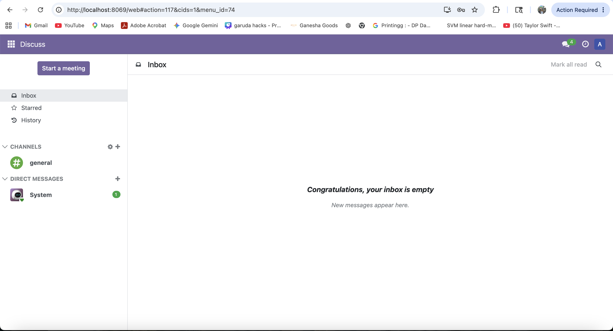
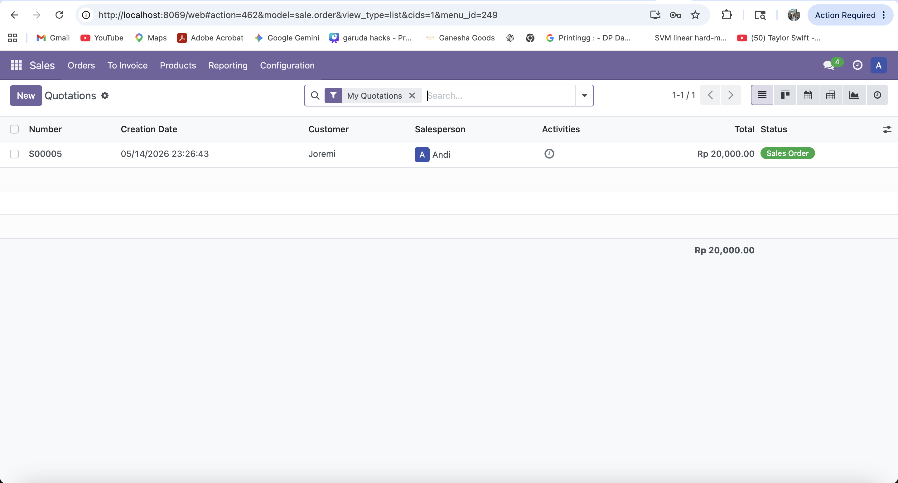
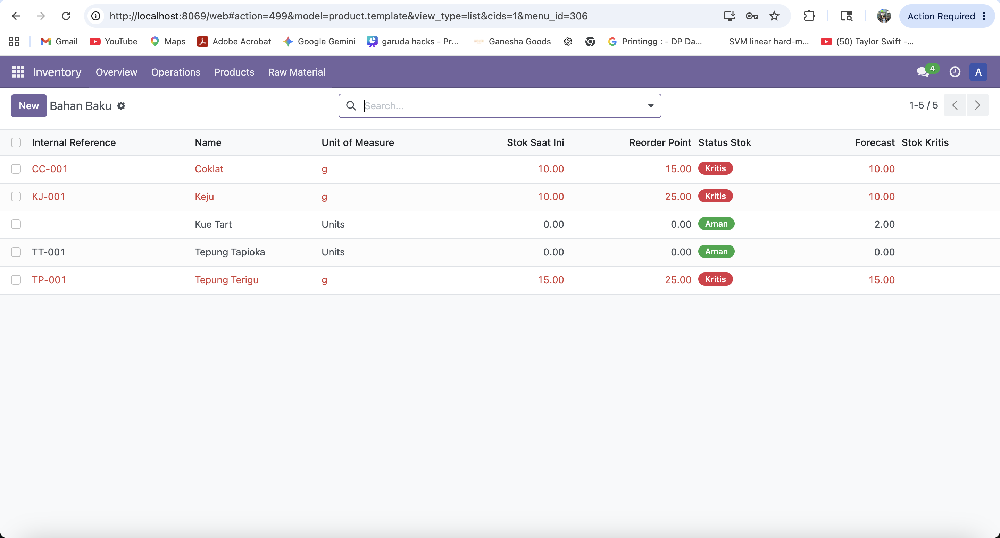
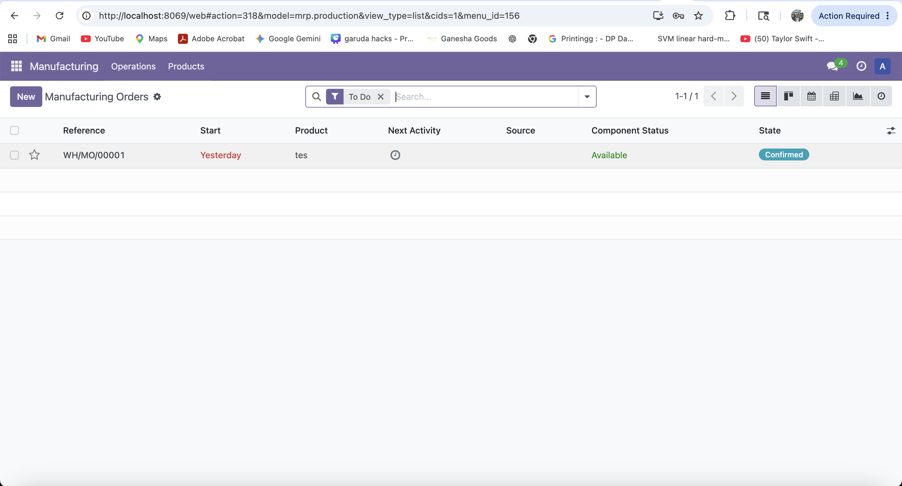
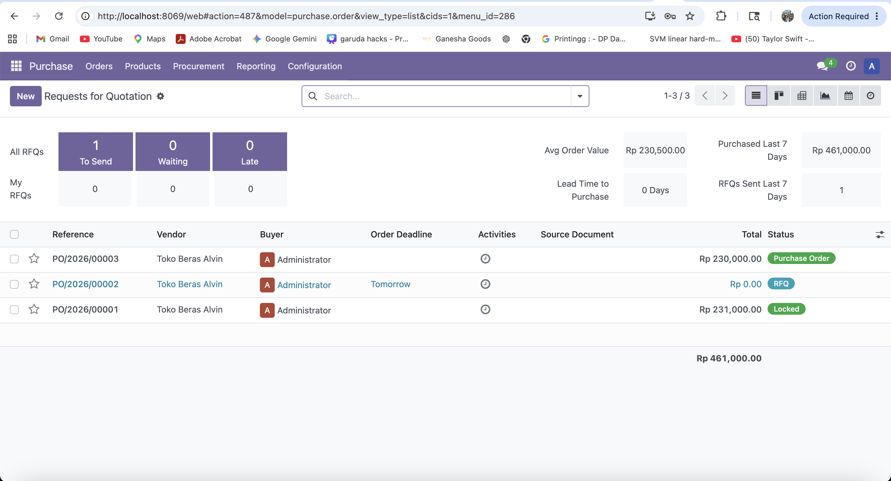
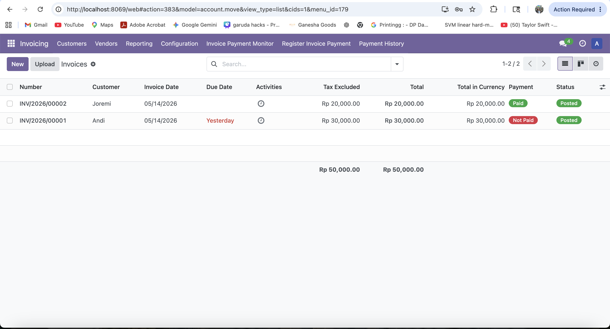
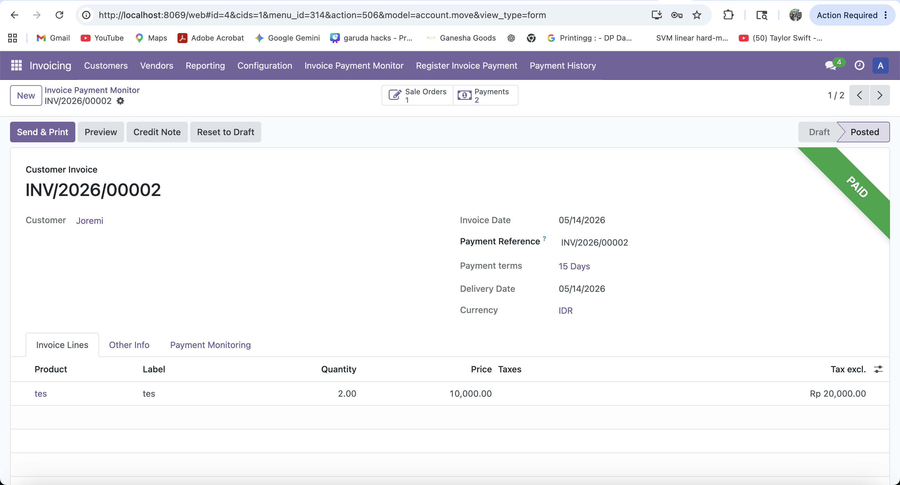
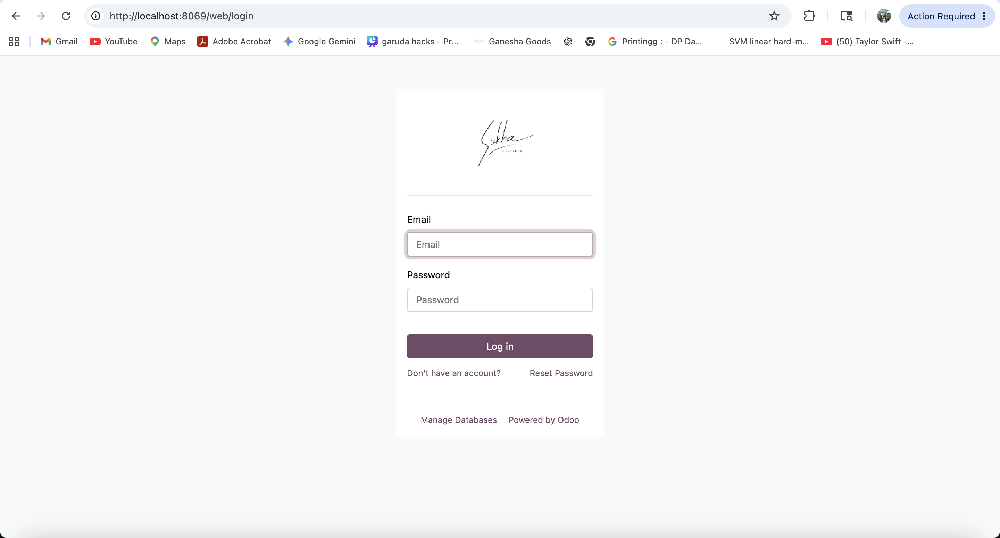

# Sistem Informasi Terintegrasi Sukha Delights berbasis Odoo

## 1. Identitas Kelompok

| Keterangan | Detail |
|---|---|
| Nama Kelompok | Kelompok 04 |
| Nomor Kelompok | G04 |
| Nomor Kelas | K01 |

### Anggota Kelompok

| NIM | Nama |
|---|---|
| 13523031 | Rafen Max Alessandro |
| 13523033 | Alvin Christopher Santausa |
| 13523040 | Kenneth Poenadi |
| 13523049 | Muhammad Fithra Rizki |
| 13523057 | Faqih Muhammad Syuhada |

## 2. Nama Sistem dan Perusahaan

| Keterangan | Detail |
|---|---|
| Nama Perusahaan | Sukha Delights |
| Nama Sistem | Sistem Informasi Terintegrasi Sukha Delights berbasis Odoo |

Sistem Informasi Terintegrasi Sukha Delights berbasis Odoo merupakan sistem yang digunakan untuk membantu digitalisasi proses operasional Sukha Delights. Sistem ini difokuskan pada pengelolaan proses inventori, produksi, pengadaan, penjualan, dan keuangan agar aktivitas bisnis dapat berjalan lebih terstruktur dan terdokumentasi.

## 3. Deskripsi Sistem

Sukha Delights masih memiliki proses operasional yang dilakukan secara manual dan terpisah, seperti pencatatan stok bahan baku, koordinasi produksi melalui Surat Perintah Kerja (SPK), pengelolaan supplier, pembuatan invoice, serta monitoring pembayaran. Kondisi ini dapat menyebabkan koordinasi antar divisi menjadi lambat, risiko human error meningkat, dan data operasional sulit dipantau secara terpusat.

Sistem informasi ini dibangun menggunakan Odoo ERP dengan beberapa modul utama, yaitu Sales, Inventory, Manufacturing, Purchase, dan Accounting. Sistem ini bertujuan untuk mengintegrasikan data penjualan, stok bahan baku, produksi, pengadaan, dan keuangan agar proses bisnis menjadi lebih cepat, terdokumentasi, dan mudah dipantau oleh pihak manajemen.

## 4. Modul yang Diimplementasikan

- **Sales**: mencatat pesanan pelanggan dari toko fisik, WhatsApp, dan marketplace sehingga seluruh order dapat terdokumentasi dalam satu sistem.
- **Inventory**: memantau stok bahan baku secara real-time, mencatat stok masuk dan keluar, serta membantu pengelolaan reorder point untuk menjaga ketersediaan bahan baku.
- **Manufacturing**: membuat SPK digital, memantau status produksi, serta menyimpan SOP atau resep standar untuk mendukung konsistensi proses produksi.
- **Purchase**: mengelola data supplier dan membuat purchase order untuk kebutuhan pengadaan bahan baku maupun kebutuhan operasional lainnya.
- **Accounting**: membuat invoice, mengelola kontra bon, serta memantau piutang pelanggan atau cabang agar proses keuangan lebih mudah dilacak.

## 5. Cara Menjalankan Sistem

Sistem dapat dijalankan pada lingkungan lokal menggunakan Docker dan Odoo. Pastikan Docker Desktop telah aktif sebelum menjalankan sistem.

```bash
docker compose up -d
```

Setelah service berjalan, sistem dapat diakses melalui:

```text
http://localhost:8069
```

### Langkah 1: Membuka Sistem Odoo

Instruksi:
Buka browser, lalu akses URL sistem Odoo pada server lokal atau server deployment.

Expected Result:
Pengguna melihat halaman login Odoo.



### Langkah 2: Login ke Sistem

Instruksi:
Masukkan email atau username dan password sesuai kredensial role yang digunakan, lalu klik tombol login.

Expected Result:
Pengguna berhasil masuk ke dashboard utama Odoo sesuai hak akses role.



### Langkah 3: Membuka Modul Sales

Instruksi:
Pada halaman utama Odoo, pilih modul **Sales** untuk membuka fitur pengelolaan pesanan pelanggan.

Expected Result:
Pengguna melihat halaman modul Sales yang berisi menu quotation, sales order, dan data pelanggan.



### Langkah 4: Membuka Modul Inventory

Instruksi:
Pada halaman utama Odoo, pilih modul **Inventory** untuk membuka fitur pengelolaan stok bahan baku dan pergerakan barang.

Expected Result:
Pengguna melihat halaman modul Inventory yang menampilkan informasi stok, receipt, delivery, dan transfer barang.

Dapat Masuk ke Raw Material Usage dan Klik Raw Material Pada Navbar, Pencet Bahan Baku



### Langkah 5: Membuka Modul Manufacturing

Instruksi:
Pada halaman utama Odoo, pilih modul **Manufacturing** untuk membuka fitur produksi dan SPK digital.

Expected Result:
Pengguna melihat halaman modul Manufacturing yang berisi daftar manufacturing order, status produksi, dan informasi proses produksi.



### Langkah 6: Membuka Modul Purchase

Instruksi:
Pada halaman utama Odoo, pilih modul **Purchase** untuk membuka fitur pengadaan dan pengelolaan supplier.

Expected Result:
Pengguna melihat halaman modul Purchase yang berisi request for quotation, purchase order, dan data supplier.



### Langkah 7: Membuka Modul Accounting

Instruksi:
Pada halaman utama Odoo, pilih modul **Invoicing** untuk membuka fitur invoice, kontra bon, dan monitoring piutang.

Expected Result:
Pengguna melihat halaman modul Invoicing yang menampilkan menu customer invoices, vendor bills, payment, dan laporan keuangan.



### Langkah 8: Mencoba Membuat Data Transaksi atau Dokumen Sederhana

Instruksi:
Buat salah satu dokumen sederhana sesuai role yang digunakan, misalnya quotation pada Sales, receipt bahan baku pada Inventory, manufacturing order pada Manufacturing, purchase order pada Purchase, atau invoice pada Accounting.

Expected Result:
Dokumen berhasil dibuat, tersimpan di sistem, dan dapat dilihat kembali pada daftar dokumen modul terkait.



### Langkah 9: Logout dari Sistem

Instruksi:
Klik profil pengguna pada pojok kanan atas, lalu pilih menu logout.

Expected Result:
Pengguna keluar dari sistem dan kembali ke halaman login Odoo.



## 6. Kredensial Role

| Role | Email/Username | Password | Akses Modul |
|---|---|---|---|
| Staff Sukha Delights | Andi@Sukha.com | andi | Sales, Inventory, Manufacturing, Purchase, Accounting |

## 7. Import dan Export Database Dump

Odoo menggunakan database PostgreSQL dan filestore untuk menyimpan data sistem. Oleh karena itu, proses import dan export database digunakan untuk menyimpan, memindahkan, atau membagikan kondisi akhir sistem kepada anggota kelompok lain.

### Export Database

Gunakan command berikut untuk membuat dump database dan filestore terbaru:

```bash
./scripts/export_db.sh
```

Expected Result:
File dump terbaru akan dibuat pada folder `dump/` dengan format nama seperti berikut:

```text
odoo_backup_YYYYMMDD_HHMMSS.dump
odoo_backup_YYYYMMDD_HHMMSS_filestore.tar.gz
```

### Import Database

Gunakan command berikut untuk melakukan restore database dan filestore dari dump terbaru yang tersedia pada folder `dump/`:

```bash
./scripts/import_db.sh
```

Jika ingin melakukan import dari file tertentu, gunakan path file dump sebagai argumen:

```bash
./scripts/import_db.sh dump/nama_file_backup.dump
```

Expected Result:
Database `sukha_final` berhasil dibuat ulang, filestore berhasil dipulihkan, dan service Odoo kembali berjalan.

Catatan: file `.dump` dan `_filestore.tar.gz` dengan timestamp yang sama perlu disertakan bersama agar data database dan file attachment Odoo tetap konsisten.

## 8. Kesimpulan dan Saran

Sistem informasi terintegrasi berbasis Odoo dapat membantu Sukha Delights meningkatkan efisiensi operasional, mengurangi proses manual, mempercepat koordinasi antar divisi, dan menyediakan data yang lebih siap digunakan untuk pengambilan keputusan. Dengan integrasi antara Sales, Inventory, Manufacturing, Purchase, dan Accounting, proses bisnis perusahaan dapat berjalan lebih terdokumentasi dan mudah dipantau.

Sistem ini dapat dikembangkan lebih lanjut dengan penambahan dashboard analitik, integrasi marketplace, notifikasi otomatis yang lebih lengkap, serta pelatihan pengguna agar implementasi sistem berjalan optimal. Pengembangan lanjutan tersebut diharapkan dapat meningkatkan kualitas pemantauan operasional dan mendukung pertumbuhan bisnis Sukha Delights secara berkelanjutan.
